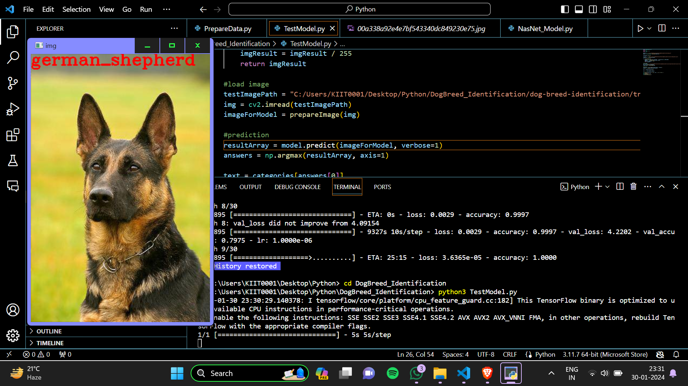
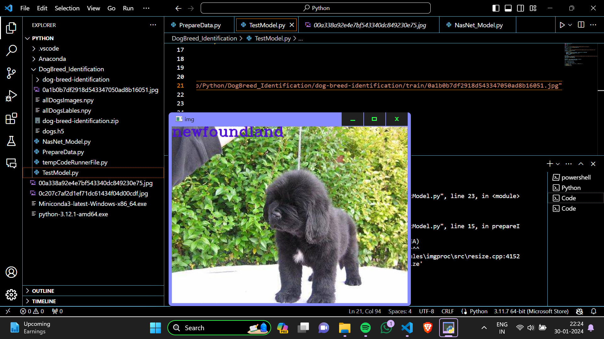
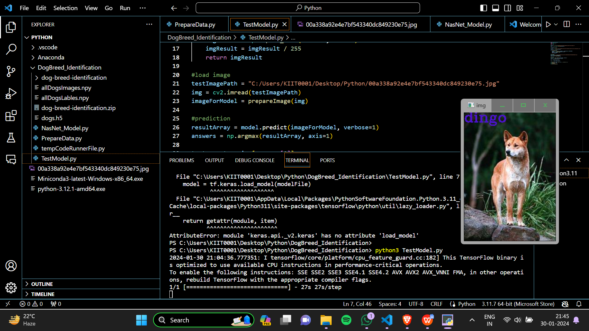

 # Dog Breed Identification

## Overview

This Dog Breed Identification project is designed to accurately classify dog breeds from images using deep learning techniques. The model is built using Python, TensorFlow, and Keras, showcasing proficiency in convolutional neural networks.

## Project Structure

- `data/`: Contains the dataset used for training and testing.
- `models/`: Includes saved models and model architecture files.
- `src/`: Consists of Python scripts for data preprocessing, model training, and evaluation.
- `requirements.txt`: Lists all the required dependencies for the project.

## Getting Started

1. Clone the repository: git clone https://github.com/Matrix-Stark/Dog-Breed-Identification.git
2.  Install dependencies: https://drive.google.com/drive/folders/17tMop6NVQEukf8r81-L8jxQI-Co1VJCt?usp=drive_link
                          https://drive.google.com/file/d/1jsxN9hoAD00IVbKbDX_9MwWtU9F4LYZB/view?usp=sharing
                          https://drive.google.com/file/d/1wlQfy8rb_XCnZMTOqVX0052CKOHDp2Td/view?usp=drive_link

## Output

